# Brokr Platform

<div align="center">

**Enterprise-Grade Kafka Management and Monitoring Platform**

[](https://www.oracle.com/java/)
[](https://spring.io/projects/spring-boot)
[](https://reactjs.org/)
[](https://www.typescriptlang.org/)
[](https://www.postgresql.org/)
[](https://graphql.org/)
[](https://www.gnu.org/licenses/agpl-3.0)

</div>

## Table of Contents

- [Overview](#overview)
- [Key Features](#key-features)
- [Architecture](#architecture)
- [Technology Stack](#technology-stack)
- [Getting Started](#getting-started)
  - [Prerequisites](#prerequisites)
  - [Installation](#installation)
  - [Configuration](#configuration)
  - [Running the Application](#running-the-application)
- [Project Structure](#project-structure)
- [API Documentation](#api-documentation)
- [Authentication & Authorization](#authentication--authorization)
- [Deployment](#deployment)
- [Development](#development)
- [Development Guidelines](#development-guidelines)
- [License](#license)

## Overview

**Brokr** is a comprehensive, enterprise-ready platform designed for managing and monitoring Apache Kafka clusters at scale. It provides a unified interface for organizations to manage multiple Kafka clusters, topics, consumer groups, and related infrastructure components across different environments.

The platform is built with a focus on:
- **Multi-tenancy**: Support for multiple organizations with isolated data and access control
- **Security**: Role-based access control (RBAC) with fine-grained permissions
- **Scalability**: Modular architecture that scales with your infrastructure
- **Flexibility**: GraphQL API for efficient data fetching and REST API for standard operations
- **User Experience**: Modern, responsive web interface built with React and TypeScript

### What Brokr Does

Brokr connects to **external Kafka clusters** via bootstrap servers configured by administrators. It does not require Kafka to be part of its infrastructure—instead, it acts as a monitoring and management layer that connects to your existing Kafka deployments, whether they're on-premises, in the cloud, or hybrid environments.

## Key Features

### 🏢 Multi-Organization Management
- Create and manage multiple organizations with isolated data
- Environment-based organization structure (Production, Development, Staging, etc.)
- Hierarchical access control per organization
- Organization detail pages with user and environment management
- Admin dashboard for platform-wide overview

### 🔐 Advanced Security & Access Control
- **Four Role Levels**:
  - `SUPER_ADMIN`: Full platform access across all organizations
  - `SERVER_ADMIN`: Server-level administrative access
  - `ADMIN`: Organization-level administrative access
  - `VIEWER`: Read-only access to assigned environments
- Environment-based access restrictions for VIEWER users
- JWT-based authentication with secure token management
- Email-based login system

### 🔑 API Key Management
- **Programmatic Access**: Create and manage API keys for automated access
- **Fine-Grained Scopes**: Granular permission control with 18+ scopes:
  - `clusters:read/write` - Cluster management
  - `topics:read/write` - Topic operations
  - `messages:read/write` - Message access
  - `consumer-groups:read/write` - Consumer group management
  - `metrics:read` - Metrics access
  - `replay:read/write` - Replay job management
  - `schema-registry:read/write` - Schema operations
  - `kafka-connect:read/write` - Connect management
  - `kafka-streams:read/write` - Streams operations
  - `ksqldb:read/write` - ksqlDB queries
- **Key Lifecycle Management**:
  - Create, edit, rotate, revoke, and delete API keys
  - Expiration date configuration
  - Automatic secret rotation with grace period
  - Soft delete for audit trail
- **Usage Analytics**:
  - Request count tracking (total, success, errors)
  - Error rate calculation
  - Average response time monitoring
  - Time-series usage charts with customizable date ranges
  - Last used timestamp tracking
- **Security Features**:
  - BCrypt hashed secrets (never stored in plain text)
  - Key prefix for identification (`brokr_<uuid>`)
  - Revocation with reason tracking
  - Active/inactive status management
  - Organization-scoped keys

### 📊 Kafka Cluster Management
- Register and manage multiple Kafka clusters
- Connection health monitoring with automatic status checks
- Support for various security protocols:
  - PLAINTEXT
  - SSL/TLS
  - SASL_PLAINTEXT
  - SASL_SSL
- SASL authentication (PLAIN, SCRAM-SHA-256, SCRAM-SHA-512)
- SSL/TLS certificate management
- Cluster reachability testing

### 📝 Topic Management
- View all topics across clusters with search functionality
- Topic details including partitions, replication factor, and configuration
- Topic creation and configuration management
- Message browsing and inspection with partition/offset selection
- Partition-level offset information
- Topic deletion with safety checks
- Real-time topic metrics and analytics

### 👥 Consumer Group Monitoring
- Real-time consumer group status monitoring
- Member information and partition assignments
- Lag monitoring and offset tracking
- Consumer group offset reset capabilities
- Detailed consumer group metrics

### 📋 Schema Registry Integration
- Connect and manage multiple Schema Registry instances
- View and manage Avro schemas
- Schema version history
- Subject management
- Schema compatibility checking

### 🔌 Kafka Connect Management
- Monitor Kafka Connect clusters
- Connector status and configuration management
- Task monitoring and management
- Connector lifecycle operations (start, stop, restart, pause, resume)

### 🌊 Kafka Streams Monitoring
- Monitor Kafka Streams applications
- Thread and task metadata visualization
- Application state tracking
- Performance metrics

### 🔍 ksqlDB Integration
- Connect and manage multiple ksqlDB instances
- Interactive SQL query editor with CodeMirror 6 syntax highlighting
- Execute queries and view formatted results
- Stream and table management (SHOW STREAMS, SHOW TABLES)
- Query history tracking with filtering (by query type and status)
- Save and load query templates
- Real-time query execution with error handling

### 📈 Dashboard & Analytics
- Organization-wide cluster overview
- Real-time metrics and statistics
- Visual representations of cluster health
- Environment-based filtering and views
- Recent activity feed from audit logs (admin-only)
- Aggregated topic and consumer group counts across all clusters
- Quick action shortcuts
- Cluster status indicators (Online/Offline)

### 📊 Time-Series Metrics & Analytics
- **Topic Metrics**:
  - Producer throughput (messages/sec in) over time
  - Producer data transfer rates (bytes/sec in)
  - Topic size growth tracking
  - Partition-level metrics
  - Note: Consumer metrics are tracked separately in ConsumerGroupMetrics
- **Consumer Group Metrics**:
  - Consumer lag trends (total, max, min, avg)
  - Member count tracking
  - Per-topic lag visualization
- **Cluster Metrics**:
  - Cluster-wide throughput aggregation
  - Total data transfer across all topics
  - Resource utilization (topics, partitions, brokers)
  - Health status tracking
- **Features**:
  - Interactive charts with time range selection (1h, 6h, 24h, 7d, 30d, today)
  - Tabbed interface for organized metric views (reduces page clutter)
  - Automatic metrics collection every 30 seconds
  - Historical data retention in PostgreSQL
  - Enterprise-grade performance with:
    - Batch processing (1000 topics/batch, 500 consumer groups/batch)
    - Async execution with dedicated thread pools
    - Connection pooling (HikariCP with 50 max connections)
    - In-memory caching (Caffeine cache with 5-minute TTL)
    - Throughput calculation via snapshot comparison
    - Parallel metric collection across clusters

## Architecture

Brokr follows a modular, microservices-ready architecture with clear separation of concerns:

```mermaid
graph TD
    %% --- DARK MODE STYLING DEFINITIONS ---
    %% Dark fills with bright, high-contrast borders and light text
    classDef fe fill:#0d1b2a,stroke:#4cc9f0,stroke-width:2px,color:#e0e1dd,rx:5,ry:5
    classDef api fill:#1b140a,stroke:#fb8500,stroke-width:2px,color:#e0e1dd,rx:5,ry:5
    classDef mod fill:#1a0f1a,stroke:#c77dff,stroke-width:2px,color:#e0e1dd,rx:5,ry:5
    classDef db fill:#0f1a15,stroke:#57cc99,stroke-width:2px,color:#e0e1dd
    
    %% --- NODES & SUBGRAPHS ---
    
    subgraph FE_Layer [ 🖥️ Frontend Layer ]
        direction TB
        FE_Tech[<b>React 19 + TS 5.9</b><br/>Vite + Tailwind CSS 4]
        FE_Arch[Pages • Components • Hooks]
        FE_Tech --- FE_Arch
    end

    subgraph API_Layer [ ⚙️ API Gateway Layer ]
        direction TB
        API_Tech[<b>Spring GraphQL + REST</b><br/>Security + JWT Filters]
        API_Arch[Resolvers • Controllers • Security]
        API_Tech --- API_Arch
    end

    subgraph Modules [ 📦 Modular Services ]
        direction LR
        SEC[<b>Security Module</b><br/>Auth, JWT, API Keys]
        KAF[<b>Kafka Module</b><br/>Streams, Metrics]
        STO[<b>Storage Module</b><br/>JPA, Repositories]
    end

    Database[(<b>PostgreSQL 16</b><br/>Relational • Time-Series)]

    %% --- CONNECTIONS (Bright White for contrast) ---
    linkStyle default stroke:#ffffff,stroke-width:2px,fill:none;

    FE_Layer == HTTP / GraphQL ==> API_Layer
    API_Layer --> SEC
    API_Layer --> KAF
    API_Layer --> STO
    STO == JDBC ==> Database

    %% --- APPLY STYLES ---
    class FE_Layer,FE_Tech,FE_Arch fe
    class API_Layer,API_Tech,API_Arch api
    class SEC,KAF,STO mod
    class Database db
```



### Backend Modules

1. **brokr-core**: Domain models and business logic
2. **brokr-storage**: JPA entities and database repositories
3. **brokr-kafka**: Kafka client integration and services (includes metrics collection)
4. **brokr-security**: Authentication, authorization, API key management, and security services
5. **brokr-api**: GraphQL resolvers and REST controllers
6. **brokr-app**: Spring Boot application configuration and entry point

### Frontend Architecture

- **Component-based**: Reusable UI components with Radix UI primitives
- **State Management**: Zustand for global state, React Query for server state
- **Routing**: React Router with protected routes
- **Form Handling**: React Hook Form with Zod validation
- **Component-based**: Reusable UI components with Radix UI primitives
- **State Management**: Zustand for global state, React Query for server state
- **Routing**: React Router with protected routes
- **Form Handling**: React Hook Form with Zod validation
- **API Communication**: GraphQL with code generation

### Deployment Architecture

Brokr Platform is designed as a **Single-Jar Application** for production. The frontend is built and bundled as static resources within the Spring Boot backend JAR. This simplifies deployment to a single artifact that serves both the API and the UI.

## Technology Stack

### Backend
- **Java 17**: Modern Java features and performance
- **Spring Boot 3.x**: Enterprise application framework
- **Spring Security**: Authentication and authorization
- **Spring GraphQL**: GraphQL API implementation
- **Spring Data JPA**: Database abstraction layer
- **PostgreSQL 16**: Relational database with time-series data support
- **Flyway**: Database migration management
- **JWT (JJWT)**: Token-based authentication
- **Apache Kafka Client**: Kafka integration
- **HikariCP**: High-performance JDBC connection pool
- **Caffeine Cache**: In-memory caching for metrics
- **Lombok**: Reduced boilerplate code
- **Maven**: Build and dependency management

### Frontend
- **React 19**: UI library
- **TypeScript 5.9**: Type-safe JavaScript
- **Vite**: Fast build tool and dev server
- **Tailwind CSS 4**: Utility-first CSS framework
- **Radix UI (shadcn/ui)**: Accessible component primitives
- **React Router 7**: Client-side routing
- **React Query (TanStack Query)**: Server state management
- **React Hook Form**: Form state management
- **Zod**: Schema validation
- **GraphQL**: API query language
- **Zustand**: Lightweight state management
- **Sonner**: Toast notifications
- **Lucide React**: Icon library
- **Recharts**: Data visualization
- **CodeMirror 6**: Code editor for ksqlDB queries
- **date-fns**: Date formatting and manipulation

### Infrastructure
- **Docker**: Containerization
- **Docker Compose**: Multi-container orchestration
- **PostgreSQL**: Database
- **Nginx** (optional): Reverse proxy and static file serving

## Getting Started

### Prerequisites

- **Java Development Kit (JDK) 17** or higher
- **Node.js 20** or higher (LTS recommended)
- **Maven 3.8+**
- **PostgreSQL 16** (or use Docker Compose)
- **Docker** and **Docker Compose** (for containerized deployment)

### Installation

#### 1. Clone the Repository

```bash
git clone <repository-url>
cd brokr-platform
```

#### 2. Build & Run (Production Mode)

The easiest way to run the application is using Docker, which automatically builds the frontend and bundles it with the backend.

```bash
docker-compose up -d --build
```

This will start the entire platform (Database, Kafka, Backend+Frontend) in containers.

#### 3. Manual Build (Single Jar)

If you prefer to run without Docker, you can build the single executable JAR:

1.  **Build Frontend**:
    ```bash
    cd brokr-frontend
    npm install
    npm run build
    ```

2.  **Copy Assets**:
    Copy the build artifacts to the backend static resources:
    ```bash
    # Linux/Mac
    mkdir -p ../brokr-backend/brokr-app/src/main/resources/static
    cp -r dist/* ../brokr-backend/brokr-app/src/main/resources/static/
    ```

3.  **Build Backend**:
    ```bash
    cd ../brokr-backend
    mvn clean package -DskipTests
    ```

4.  **Run**:
    ```bash
    java -jar brokr-app/target/brokr-app-2.0.1-SNAPSHOT.jar
    ```

The application will be available at `http://localhost:8080` (both UI and API).

### Configuration

#### Backend Configuration

Edit `brokr-backend/brokr-app/src/main/resources/application.yml`:

```yaml
spring:
  datasource:
    url: jdbc:postgresql://localhost:5432/brokr
    username: postgres
    password: your_password
  
  jpa:
    hibernate:
      ddl-auto: validate
    show-sql: false

jwt:
  secret: your-secret-key-change-in-production
  expiration: 86400000 # 24 hours in milliseconds
```

#### Frontend Configuration

Create `brokr-frontend/.env`:

```env
VITE_API_URL=http://localhost:8080
VITE_GRAPHQL_ENDPOINT=http://localhost:8080/graphql
```

### Running the Application

#### Option 1: Docker Compose (Recommended)

```bash
docker-compose up -d
```

This will start:
- PostgreSQL database
- Backend application
- Frontend application (if configured)
- Optional Kafka clusters for testing (3-node KRaft cluster)
- Schema Registry
- Kafka Connect
- ksqlDB Server

#### Option 2: Development Mode (Hot Reload)

For development, you can run the backend and frontend separately to enable hot-reloading.

**1. Start Backend**:
```bash
cd brokr-backend
mvn spring-boot:run
```

**2. Start Frontend**:
```bash
cd brokr-frontend
npm run dev
```

- **Frontend**: http://localhost:5173 (Proxies API requests to backend)
- **Backend API**: http://localhost:8080
- **GraphQL Playground**: http://localhost:8080/graphql

## Project Structure

```
brokr-platform/
├── brokr-backend/              # Backend application
│   ├── brokr-core/            # Domain models and business logic
│   ├── brokr-storage/         # Database entities and repositories
│   ├── brokr-kafka/           # Kafka client integration and metrics
│   ├── brokr-security/        # Security and authentication
│   ├── brokr-api/             # GraphQL and REST APIs
│   └── brokr-app/             # Spring Boot application
│       └── src/main/resources/
│           └── db/           # Flyway database migrations
├── brokr-frontend/            # Frontend application
│   ├── src/
│   │   ├── components/       # React components
│   │   │   ├── admin/       # Admin management components
│   │   │   ├── clusters/    # Cluster management components
│   │   │   ├── metrics/     # Metrics chart components
│   │   │   ├── ksqldb/      # ksqlDB query editor components
│   │   │   └── ui/          # Reusable UI components (shadcn/ui)
│   │   ├── pages/           # Page components
│   │   │   ├── admin/      # Admin pages (organizations, audit logs)
│   │   │   └── ...         # Feature pages (clusters, topics, etc.)
│   │   ├── hooks/           # Custom React hooks
│   │   ├── graphql/         # GraphQL queries and mutations
│   │   ├── lib/             # Utility functions
│   │   └── store/           # State management (Zustand)
│   └── public/              # Static assets
├── docker-compose.yml        # Docker Compose configuration
├── PLATFORM_IMPROVEMENTS.md  # Future improvements roadmap
└── README.md                 # This file
```

## API Documentation

### GraphQL API

Brokr provides a comprehensive GraphQL API for flexible data querying. The GraphQL schema is available at `/graphql` endpoint.

**Example Queries**:

**Get Clusters**:
```graphql
query GetClusters($organizationId: String) {
  clusters(organizationId: $organizationId) {
    id
    name
    bootstrapServers
    isReachable
    organization {
      id
      name
    }
    environment {
      id
      name
      type
    }
    brokers {
      id
      host
      port
    }
    topics {
      name
      partitions {
        id
        leader {
          id
        }
      }
    }
  }
}
```

**Get Topic Metrics**:
```graphql
query GetTopicMetrics($clusterId: ID!, $topicName: String!, $timeRange: MetricsTimeRangeInput!) {
  topicMetrics(clusterId: $clusterId, topicName: $topicName, timeRange: $timeRange) {
    id
    timestamp
    messagesPerSecondIn
    bytesPerSecondIn
    totalSizeBytes
    partitionCount
  }
}
```

**Get Consumer Group Metrics**:
```graphql
query GetConsumerGroupMetrics($clusterId: ID!, $consumerGroupId: String!, $timeRange: MetricsTimeRangeInput!) {
  consumerGroupMetrics(clusterId: $clusterId, consumerGroupId: $consumerGroupId, timeRange: $timeRange) {
    id
    timestamp
    totalLag
    maxLag
    minLag
    avgLag
    memberCount
    topicLags
  }
}
```

**Get Cluster Metrics**:
```graphql
query GetClusterMetrics($clusterId: ID!, $timeRange: MetricsTimeRangeInput!) {
  clusterMetrics(clusterId: $clusterId, timeRange: $timeRange) {
    id
    timestamp
    totalMessagesPerSecond
    totalBytesPerSecond
    totalTopics
    totalPartitions
    brokerCount
    isHealthy
  }
}
```

**Get API Key Usage**:
```graphql
query GetApiKeyUsage($id: ID!, $startTime: String!, $endTime: String!) {
  apiKeyUsage(id: $id, startTime: $startTime, endTime: $endTime) {
    totalRequests
    successCount
    errorCount
    errorRate
    averageResponseTimeMs
    timeSeriesData
  }
}
```

**Execute ksqlDB Query**:
```graphql
mutation ExecuteKsqlQuery($ksqlDBId: ID!, $query: String!) {
  executeKsqlQuery(ksqlDBId: $ksqlDBId, query: $query) {
    success
    result
    error
  }
}
```

### REST API

REST endpoints are available for standard CRUD operations:

**Authentication**:
- `POST /api/v1/auth/login` - User authentication
- `POST /api/v1/auth/logout` - User logout

**Clusters**:
- `GET /api/v1/clusters` - List clusters
- `GET /api/v1/clusters/{id}` - Get cluster details
- `POST /api/v1/clusters` - Create cluster
- `PUT /api/v1/clusters/{id}` - Update cluster
- `DELETE /api/v1/clusters/{id}` - Delete cluster

**Topics**:
- `GET /api/v1/clusters/{clusterId}/topics` - List topics
- `GET /api/v1/clusters/{clusterId}/topics/{topicName}` - Get topic details
- `POST /api/v1/clusters/{clusterId}/topics` - Create topic
- `DELETE /api/v1/clusters/{clusterId}/topics/{topicName}` - Delete topic

**Consumer Groups**:
- `GET /api/v1/clusters/{clusterId}/consumer-groups` - List consumer groups
- `GET /api/v1/clusters/{clusterId}/consumer-groups/{groupId}` - Get consumer group details
- `POST /api/v1/clusters/{clusterId}/consumer-groups/{groupId}/reset-offsets` - Reset offsets

**Schema Registry**:
- `POST /api/v1/schema-registry/test-connection` - Test Schema Registry connection
- `GET /api/v1/schema-registry/{id}/subjects` - List subjects
- `GET /api/v1/schema-registry/{id}/subjects/{subject}/versions` - Get schema versions

**Kafka Connect**:
- `POST /api/v1/kafka-connect/test-connection` - Test Kafka Connect connection
- `GET /api/v1/kafka-connect/{id}/connectors` - List connectors
- `POST /api/v1/kafka-connect/{id}/connectors/{connector}/restart` - Restart connector

**ksqlDB**:
- `POST /api/v1/ksqldb/test-connection` - Test ksqlDB connection
- `POST /api/v1/ksqldb/{id}/execute` - Execute ksqlDB query
- `GET /api/v1/ksqldb/{id}/streams` - List streams (via SHOW STREAMS query)
- `GET /api/v1/ksqldb/{id}/tables` - List tables (via SHOW TABLES query)
- `GET /api/v1/ksqldb/{id}/query-history` - Get query history

**Metrics**:
- `GET /api/v1/metrics/topics/{clusterId}/{topicName}` - Get topic metrics
- `GET /api/v1/metrics/consumer-groups/{clusterId}/{groupId}` - Get consumer group metrics
- `GET /api/v1/metrics/clusters/{clusterId}` - Get cluster metrics

**API Keys**:
- `GET /api/v1/api-keys` - List user's API keys
- `GET /api/v1/api-keys/{id}` - Get API key details
- `POST /api/v1/api-keys` - Create new API key
- `PUT /api/v1/api-keys/{id}` - Update API key
- `POST /api/v1/api-keys/{id}/rotate` - Rotate API key secret
- `POST /api/v1/api-keys/{id}/revoke` - Revoke API key
- `DELETE /api/v1/api-keys/{id}` - Delete API key
- `GET /api/v1/api-keys/{id}/usage` - Get API key usage statistics

## Authentication & Authorization

### Authentication

Brokr uses JWT (JSON Web Tokens) for authentication. Upon successful login, a JWT token is stored in an HttpOnly cookie for security.

**Login Request**:

```json
POST /api/v1/auth/login
{
  "username": "user@example.com",
  "password": "password"
}
```

### Authorization Roles

1. **SUPER_ADMIN**
   - Full access to all organizations and resources
   - Can create and manage organizations
   - Can manage all users across the platform

2. **SERVER_ADMIN**
   - Server-level administrative access
   - Limited organization management

3. **ADMIN**
   - Organization-level administrative access
   - Can manage users within their organization
   - Can manage clusters, topics, and other resources in their organization
   - Can update their own organization details

4. **VIEWER**
   - Read-only access
   - Limited to environments assigned to them
   - Can view clusters, topics, consumer groups in accessible environments

### Environment-Based Access Control

VIEWER users are restricted to specific environments within their organization. They can only access clusters and resources in environments that have been explicitly assigned to them via `accessibleEnvironmentIds`.

### Admin Features

Brokr provides comprehensive administrative capabilities:

**Organization Management**:
- Create, update, and delete organizations
- View organization details with user and environment lists
- Manage organization settings and metadata

**User Management**:
- Create and manage users across organizations
- Assign roles and permissions
- Set environment access restrictions for VIEWER users
- User profile management

**Audit Logging**:
- Comprehensive audit logs for all administrative actions
- User management operations (create, update, delete)
- Organization management
- Cluster configuration changes
- Resource access tracking
- Audit logs are accessible to ADMIN and SUPER_ADMIN users
- Recent activity feed available on dashboard
- Filterable audit log pages with pagination

## Deployment

### Production Deployment

1. **Build the Application**:

```bash
# Backend
cd brokr-backend
mvn clean package -DskipTests

# Frontend
cd brokr-frontend
npm run build
```

2. **Docker Deployment**:

```bash
docker-compose -f docker-compose.prod.yml up -d
```

3. **Environment Variables**:

Set the following environment variables:

```bash
SPRING_DATASOURCE_URL=jdbc:postgresql://db:5432/brokr
SPRING_DATASOURCE_USERNAME=postgres
SPRING_DATASOURCE_PASSWORD=secure_password
JWT_SECRET=your-secret-key
```bash
SPRING_DATASOURCE_URL=jdbc:postgresql://db:5432/brokr
SPRING_DATASOURCE_USERNAME=postgres
SPRING_DATASOURCE_PASSWORD=secure_password
JWT_SECRET=your-secret-key
JWT_EXPIRATION=86400000
```

**Note**: In production, the frontend is served directly by the backend at the root path `/`. No separate web server is required for the frontend, though Nginx is recommended as a reverse proxy for SSL termination.

### Database Migrations

Flyway automatically runs database migrations on application startup. Ensure your database is accessible and has the necessary permissions.

## Development

### Backend Development

```bash
cd brokr-backend
mvn spring-boot:run
```

The backend will start on `http://localhost:8080` with hot-reload enabled (if using Spring Boot DevTools).

### Frontend Development

```bash
cd brokr-frontend
npm run dev
```

The frontend will start on `http://localhost:5173` with hot module replacement.

### Running Tests

**Backend Tests**:

```bash
cd brokr-backend
mvn test
```

**Frontend Tests**:

```bash
cd brokr-frontend
npm test
```

### Code Style

- **Backend**: Follow Java conventions and Spring Boot best practices
- **Frontend**: ESLint and Prettier configurations are included

## Development Guidelines

- Write clear, descriptive commit messages
- Add tests for new features
- Update documentation as needed
- Follow the existing code style
- Ensure all tests pass before submitting changes
- Follow the established branching strategy
- Code reviews are required before merging

## License

**Brokr Platform** is dual-licensed:

1.  **Community Edition**: Licensed under the **GNU Affero General Public License v3.0 (AGPLv3)**.
    *   Free to use, modify, and distribute.
    *   **Requires open-sourcing** of your own code if you use it to provide a service (SaaS).
    *   See [LICENSE](LICENSE) for details.

2.  **Commercial Edition**: Available for enterprises who want to use the software without AGPLv3 restrictions.
    *   Allows proprietary use in closed-source applications.
    *   Includes warranty and support.
    *   See [COMMERCIAL_LICENSE.md](COMMERCIAL_LICENSE.md) for details.

### Contributing

We welcome contributions! Please see [CONTRIBUTING.md](CONTRIBUTING.md) for guidelines.

---

## Support

For issues or questions, please contact the development team or refer to internal documentation.
